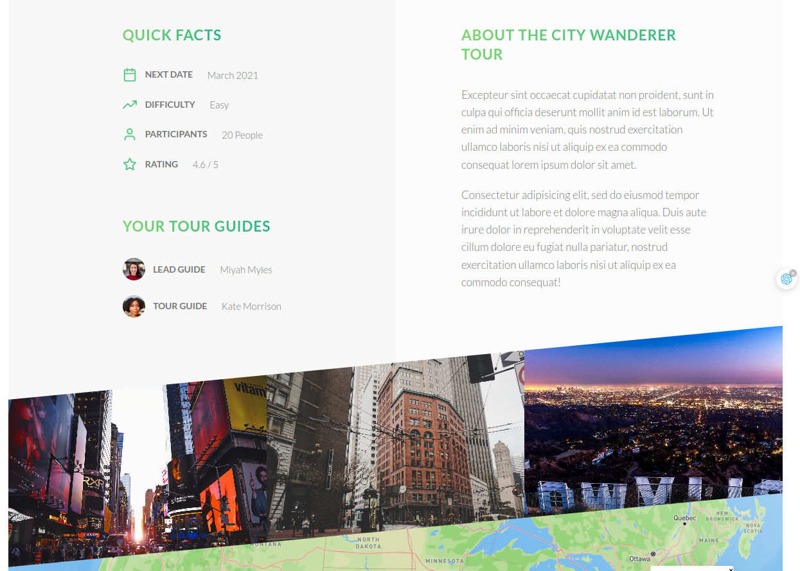
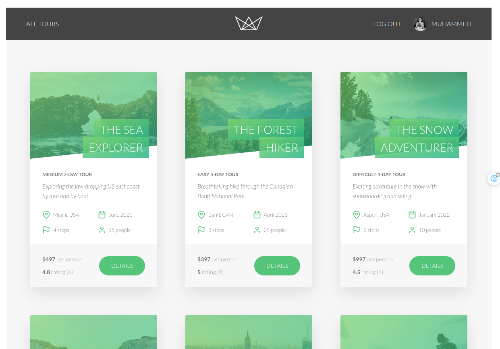
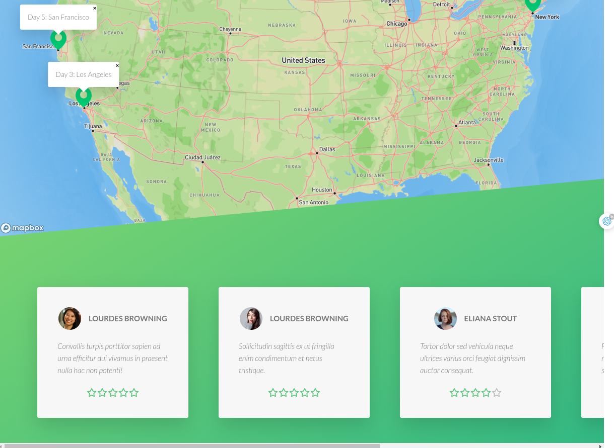
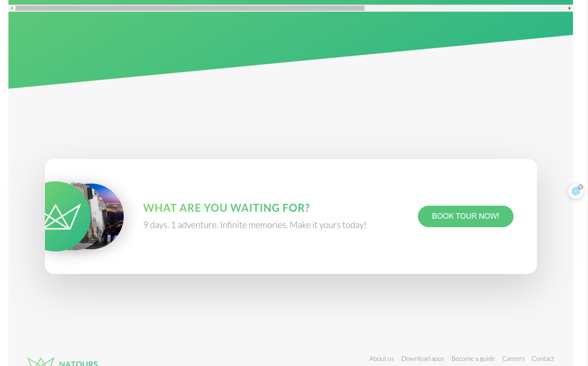
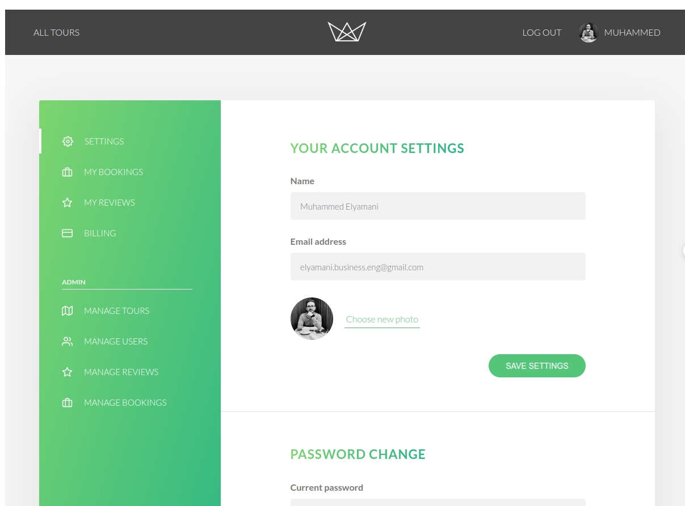
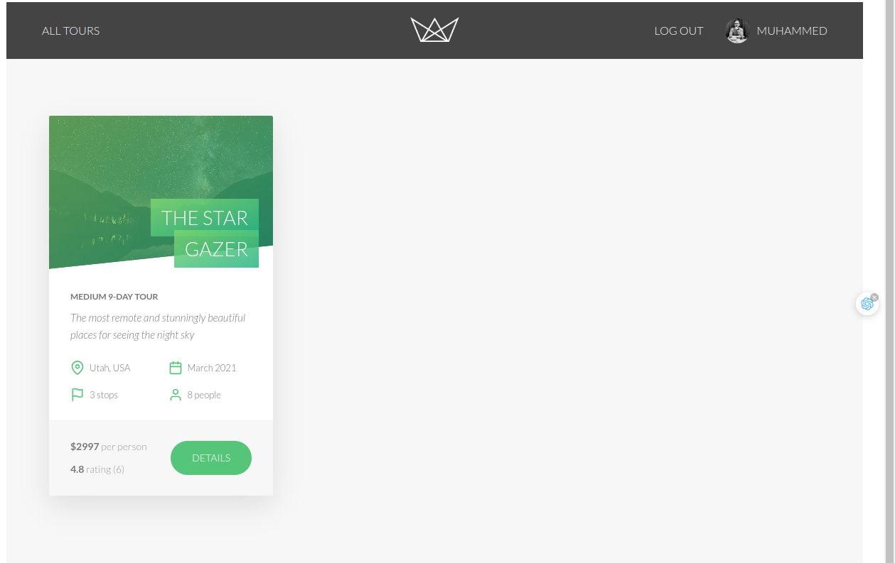
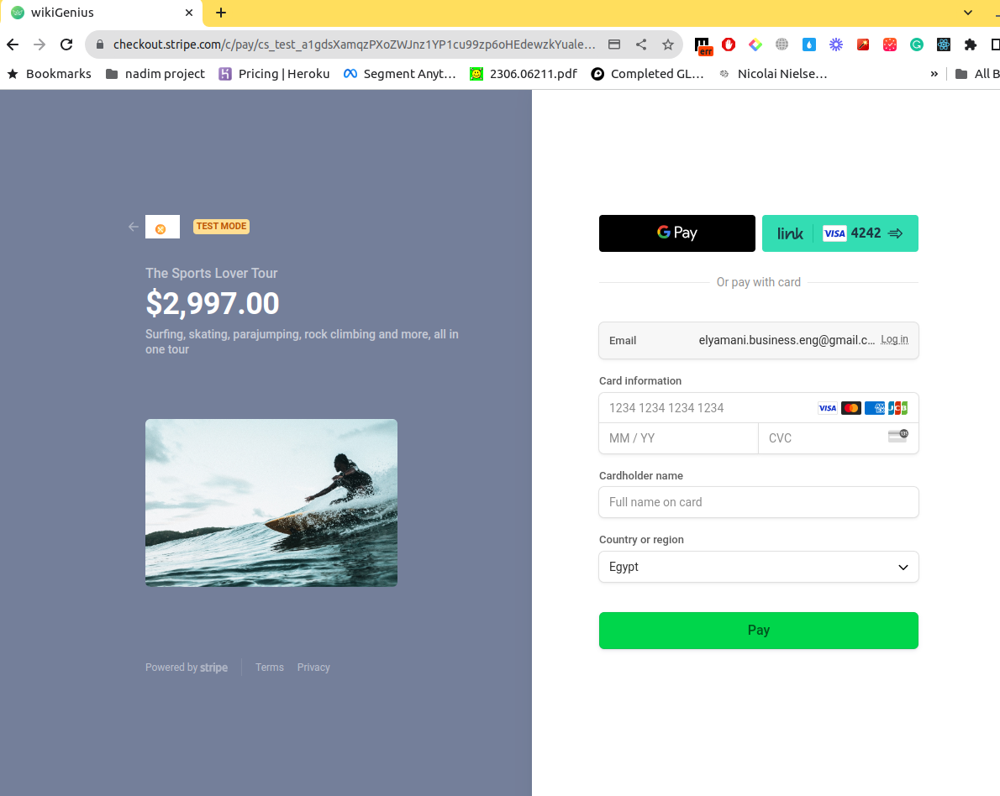

# Project Node

This project is a Node.js application that serves as a backend service for managing tours, users, reviews, and bookings. It provides APIs for different operations related to these entities.



## Tech Stack

- Node.js
- Express.js
- MongoDB
- Pug (template engine)

## Features

- RESTful APIs for managing tours, users, reviews, and bookings.
- Request rate limiting for better security.
- MongoDB data sanitization.
- XSS protection.
- Parameter pollution prevention.
- Error handling middleware.

## Installation

Clone this repository to your local machine:


```bash
git clone https://github.com/WikiGenius/project_node.git
```






